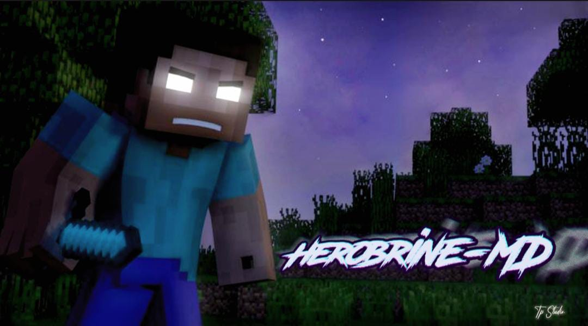

 

 
| </a> | </a> |</a> |

  

  <a href="https://github.com/Debatej2299q">
  
    
## `MAIN DEVELOPER` 
 **[» Contact For](https://wa.me/+919332425327)**

## `BOT OWNER`

**[» Contact For](https://wa.me/+918761888106)**
  
`HEROBRINE MD - By LUTHER`

  <!-- He came up with the idea of HOW to show React components as an img on a README.md and the now playing component! -->
  <i>inspired by <a href="https://github.com/Debatej2299q">HEROBRINE</a></i>

**Note:** You'll need to set these environment variables 

| Variable | Description 
|---|---|
| DATABASE_URL | URL for connecting to your mongodb database | 
| SESSION_ID | your session id | 
| REMOVEBG_KEY | API key for www.remove.bg | 
| PREFIX | put any one symbol here except @ and + , leave it Blank if you want to use multiple prefix |
| MODE | mode public or private |
| autoRead | make it true if you want bot to read messages |
| statusview | make it true if you want bot to view status | 
| OWNERS | owner number(917605902011;GURU;6281255369012;Ash) | 
| BOTNAME | Your Bot Name | 
| antidelete | bot will forward deleted messages if you make it true | 

<h4 align="left">  
 
╚═════ &nbsp;HEROBRINE NOW [𝐃𝐀𝐑𝐊⚫](https://github.com/settings/appearance#gh-dark-mode-only)[𝐁𝐑𝐈𝐆𝐇𝐓⚪](https://github.com/settings/appearance#gh-light-mode-only) 𝐈𝐍 𝐇𝐄𝐑𝐄...
<h4>

&nbsp;&nbsp;&nbsp;&nbsp;&nbsp;&nbsp;&nbsp;&nbsp;&nbsp;&nbsp;&nbsp;&nbsp;&nbsp;&nbsp;&nbsp;&nbsp;&nbsp;&nbsp;&nbsp;&nbsp;&nbsp;&nbsp;&nbsp;&nbsp;&nbsp;&nbsp;&nbsp;&nbsp;&nbsp;&nbsp;&nbsp;&nbsp;&nbsp;&nbsp;&nbsp;&nbsp;&nbsp;&nbsp;&nbsp;&nbsp;&nbsp;&nbsp;&nbsp;&nbsp;&nbsp;&nbsp;&nbsp;&nbsp;&nbsp;&nbsp;&nbsp;&nbsp;&nbsp;&nbsp;&nbsp;&nbsp;&nbsp;&nbsp;&nbsp;&nbsp;&nbsp;&nbsp;&nbsp;&nbsp;&nbsp;&nbsp;&nbsp;&nbsp;&nbsp;&nbsp;&nbsp;&nbsp;&nbsp;&nbsp;&nbsp;&nbsp;&nbsp;&nbsp;&nbsp;&nbsp;&nbsp;&nbsp;&nbsp;&nbsp;&nbsp;&nbsp;&nbsp;&nbsp;&nbsp;&nbsp;&nbsp;&nbsp;&nbsp;&nbsp;&nbsp;&nbsp;&nbsp;&nbsp;&nbsp;&nbsp;&nbsp;&nbsp;&nbsp;&nbsp;&nbsp;&nbsp;&nbsp;&nbsp;&nbsp;&nbsp;&nbsp;&nbsp;
 

